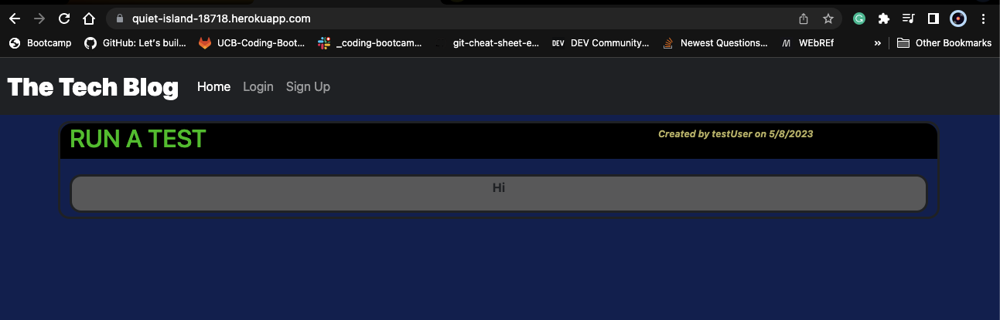
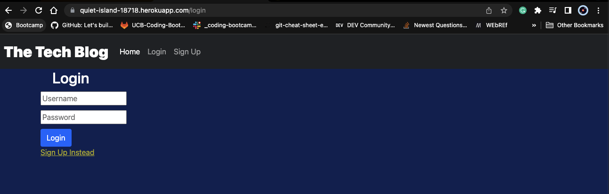
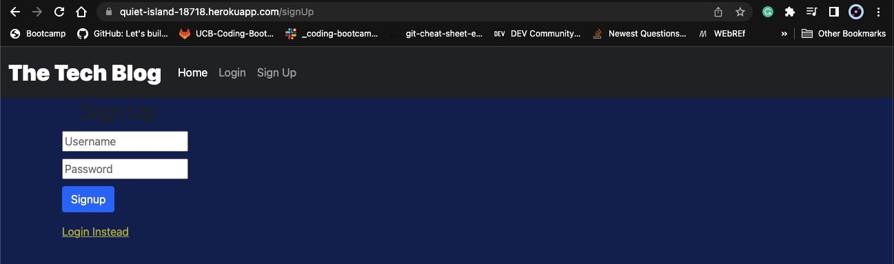

# Tech Blog

## Description 

The CMS-style blog site follows a standard user flow, ensuring a seamless and user-friendly experience for its visitors. When a user visits the site for the first time, they are presented with the homepage, which includes existing blog posts, navigation links, and the option to log in. Clicking on the homepage option takes the user back to the homepage, while clicking on any other links in the navigation prompts them to either sign up or sign in. Signing up requires the user to create a username and password, which is then saved for future logins.

Once the user is signed in, they can navigate the site with ease, using the homepage and dashboard links provided. Clicking on an existing blog post displays its title, content, creator’s username, and creation date, and allows the user to leave a comment. If the user decides to create a new blog post, they are prompted to enter both a title and contents, which is then saved for future access.

The dashboard provides a comprehensive overview of all blog posts created by the user, and the option to add, update, or delete posts. The logout option is available on the navigation bar and automatically logs out the user upon clicking. To ensure the security of the user’s account, the site automatically signs them out if they are idle for more than a set time. Overall, the CMS-style blog site provides a user-friendly interface that makes it easy for users to create, access, and manage their content.


## Table of Contents 


* [Installation](#installation)
* [Usage](#usage)
* [Credits](#credits)
* [License](#license)


## Installation

**Install or open the Vs Code.**

*  **Run CLI**

```CLI-step 1
npm i
```

```CLI-step 2
mysql -u root -p
```

```CLI-step 3 
source ./db/schema.sql
```

```CLI-step 4
 npm run seed 
 ```

 ```CLI-step 5
 npm start
 ```   

```CLI-step 6
node server.js
```

# Usage 

## Click Link below:

[Tech-Blog Website](https://quiet-island-18718.herokuapp.com/)

## Images

### Home

  


### Login



### Sign Up



## License
[](https://opensource.org/licenses/MIT)


## Credits


## Badges


[](https://www.npmjs.com/package/console.table)
[](https://standardjs.com)


## **Author**

* **Kenneth Cruz** 
- [Link to Repo](https://github.com/Cruzkenneth504/tech-blog)
- [Link to Github](https://github.com/cruzkenneth504)
- [Link to LinkedIn](linkedin.com/in/cruzkenneth504)

## **Acknowledgments**

* [UCB BootCamp](https://bootcamp.berkeley.edu/)
* [DevTools](https://dev.to/)
* [Youtube](https://www.youtube.com/)
* [Bootcamp Instructors](https://bootcamp.berkeley.edu/)
* [Tutors]( https://tinyurl.com/BootCampTutorTeam)
 
